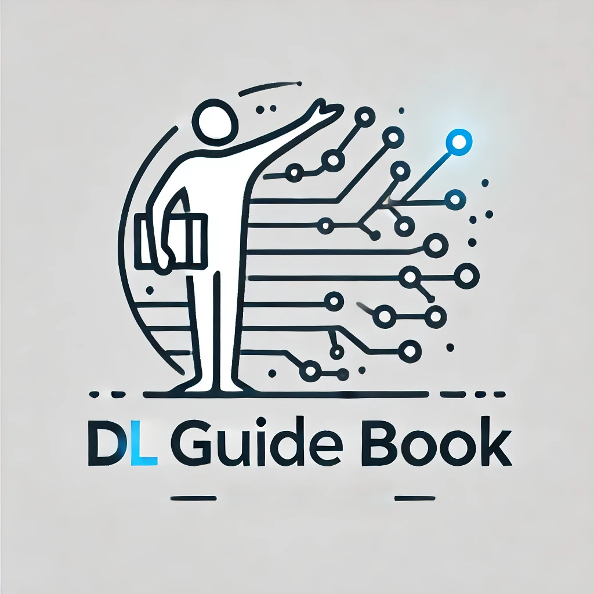

=============================================
The amateur's guide to explore Deep Learning
=============================================

Hello There !!!

I am an AI enthusiast and constantly exploring Deep Learning. These are my notes and codes that I constantly forget.
These topics are mostly coded by me but referenced from many Authors, Youtube videos, Books and free articles over the internet, So even if you want to reuse these notes you can, free of cost 😊.

This guide is generally verified by my peers and the people that I know in this field and mostly by the readers of it.
Please feel free to reach out to me if there is any issue the the documentation.

Contact Me
-----------

+-----------+--------------------------------------------+
| email     | nishantbaheti.it19@gmail.com               |
+-----------+--------------------------------------------+
| github    | https://www.github.com/nishantbaheti       |
+-----------+--------------------------------------------+
| linkedin  | https://www.linkedin.com/in/nishantbaheti/ |
+-----------+--------------------------------------------+
| ML GUIDE  | https://mlguidebook.com                    |
+-----------+--------------------------------------------+